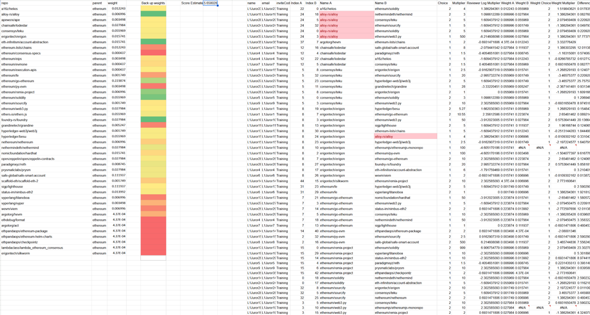

# Omniacs.DAO Quantifying Contributions of Open Source Projects to the Ethereum Universe Write-up: Grey Hatting the DeepFunding for Good

It is our hope that our candor and slight humor are well met as we describe, in painstaking detail, why we took a rather unorthodox approach to this final iteration of the Ethereum Foundation DeepFunding Challenge.

## Executive Summary:

The approach that netted us a 6th place placing was motivated by the particularly varied sources of variation and uncertainty we experienced throughout the contest. Changing datasets, changing objectives, changing jurors, changing scoring functions and changing deadlines motivated us to pivot from our initial straight forward model building methodology to a grey hat inspired gradient descent hacking approach in an attempt to see if overfitting to the only relatively stable source of truth, the public leaderboard, would net us not only a prize, but insight into which packages were impactful. This is a walk-through of how we were ultimately successful in doing so.

## Phase 1: Walking the Straight and Narrow

For nearly all of our data modelling initiatives we follow what’s called the DDEMA process, a procedure where we focus on Definitions-Data-Exploration-Modeling & Action. The initial definitions and objectives of the ask were clear: “Give weights to source repos such that their summation to the target repo = 1”. We later realized that wasn’t a strict requirement, but more on that later. Across the entirety of the tournament, we were served various datasets. Here is a sample of three of the datasets supplied to us for during the contest for training. 

Of these datasets, the most relevant spreadsheets were:

The juror data delineated for constructing the weights.

The enhanced repo data with stats on popularity and contributors.

And the sample submission file with sample weights structured in a format for easy scoring by Pond. This was just enough data for us to begin, and so we did! The first step, before any modeling was to submit a few sample submissions to create a benchmark for our future models. We submitted a few common weighting schemes to see how they fared.  These included:
    • All 0s
    • All 1s
    • Equal proportional weights
    • The sample weights
    • 3 Random Dirichlet constructed weightings

With these baseline score totals in tow be diligently began our modelling efforts…and got nowhere! We tried:
    • fitting a Bradley Terry model 
    • calculating Elo scores from the number of wins and the multiplier
    • calculating linear combinations of wins and the multiplier as scores
    • fitting random forest models based on repo statistics
    • using ChatGPT to score repos and then create pairwise comparisons
    • a Deep Neural Network trained on Graph Features
    • fit a LightGBM on score derived features
None of these approaches netted us anywhere near a winning score. 

## Phase 2: Bending the Rules
In the middle of our modeling endeavor, there was an announcement of updated training data to be released on September 15th . It was at this point that we decided to shift our focus away from the traditional modeling approach towards one that utilized all of the submissions we had amassed through the prior weeks of modeling. We were no longer interested in trying to refit each of our prior modeling approaches on the new dataset, irrespective of how similar the new data may or may not be to the prior set. This was the start of our grey hat thinking since, by this time, we’d had over 60 model submissions stored in a spreadsheet.

From analyzing the spreadsheet, we derived a few useful insights. These included:
    • realizing that the weights did not have sum to one and, instead, scores could be used
    • some repos were already predetermined to have 0 weight
    • giving a 0 weight to a non-0 weighted package caused large, detrimental swings to the loss score
    • giving a large weight to a very influential package could substantially improve the loss
    • giving a large weight to a non-influential package would moderately damage the loss score
 A univariate analysis on the individual repos was performed by taking the various weights we submitted as the independent variable and the resulting scores as the dependent. It was obvious that this wasn’t a proper representation because of the multivariate nature of the loss function’s value space, but it did give us a solid baseline to initialize our search.

It was at this point we created a “Package Weight Score Simulator” in an attempt to check our work by converting weights back into pairwise comparisons and there wise spitting back a Score estimate.  

Performing a grid search to minimize the score of our simulator resulted in our first reasonable breakthrough, a top 10 score.

With our new method and a top 10 score, we then committed to the idea of leaderboard hacking as a way to extract the most reliable weights we could then use to recalibrate our simulator and potentially refit our previous models. We then began to design our grid search.  From our experience with the leaderboard thus far, we knew that we’d need to start with a linear sweep (using values 0 – 9) as weights to get a general feel for how the leaderboard scores would look and then move on to an exponential refinement (using values 1, 2, 4, 8, 16, 32, 64, etc.) to analyze the non-linearity of the effects of singular packages on the scoring function. Unfortunately, we were up against a constraint. CryptoPond’s 3 submission per day rule. We stumbled upon an exploit for which we wrote a script that essentially stacked 20 submissions calls in a single API call and shot them through simultaneously, versus trying to submit them one by one. Turns out the API’s system counter wasn’t fully synced with the evaluator and, as a result, we were able to test a ton of submissions all in the same call.  To “more effectively perform discovery”, we employed a few extra Pond accounts and utilized them to execute the grid search.   This process was going smoothly and netted us a top 3 placing within a day.

The main insight from this search was that the multiplier from the training set was creating final weights for some packages that were orders of magnitude larger than others.  None of our traditional methods accounted for this and that is why each one failed. We contemplated sitting in 3rd place for a while, knowing we could further optimize, but we agreed to one last submission, and we accidentally jumped to the top of the leaderboard, with a HUGE lead.

While we were at the top, we felt that we might as well brag about it…

How did we know our position on the leaderboard wouldn’t last forever? First, because we know by nature of overfitting to the leaderboard, we were more subject to variability introduced by changes in the data.  If new data were to be introduced that happened to NOT be similar to the previous set of data, there was a good chance that our model would lose its place. Secondly, we knew our position wouldn’t last because the contest organizers did just that…they introduced more data at the last minute…

The leaderboard update did indeed change the scores and rank ordering of the top participants, but not by a huge amount.  This gave us even more confidence that our overfitting approach was working. Why?  In simplest terms, because on the backend the contest organizers knew there was inherent variability in the way jurors were making the pairwise selections and were actively trying to reduce variability. We were unaware of the exact mechanisms, but they were attempting to reign in the inherent inconsistencies between jurors and improve consistency even within individual jurors.  This meant that the “new, unforeseen, private” data was, in small ways, starting to converge to something consistent and if we continued seeking to minimize public leaderboard loss, we’d eventually minimize the private leaderboard loss as well. The update to the leaderboard helped confirm this.

Newly embolden, and channeling our inner Dr. Victor Von Doom, we alluded to our plan on Twitter.

And just like it says, “Pride comes before a fall”, we left our scripts running too long and the leaderboard went from this…

…to this…

We had accidentally blown up the leaderboard with our submissions.  Turns out the “exponential refinement” routine was starting to produce high scores on nearly every one of our submissions.  We had a backend procedure that allowed us to aggregate the results into one submission that we would then post officially on our account, unfortunately we let the automated scripts run too long and the dummy accounts were getting scored at the top spots.  As we said in the Telegram, “It's one thing to operate neatly in the shadows and then surprise everyone with a cool retrospective, but it is completely different when we vandalize your public leaderboard and it clearly looks botted.” 

Once we realized we blew up the leaderboard, we confessed and immediately worked with Bill @ Pond to fix the leaderboard.

After confessing, we posted our final submission under the main account, and vowed to forever be on the straight and narrow 

## Phase 3: The Final Results
After disclosing our approach, there were some questions as to why someone would purposefully overfit a model to the leaderboard. The most comprehensive answer actually came by us on Telegram here…

…but another reason was because as a team, we’ve had experience with overfit models actually performing well on out-of-sample and out-of-time hold out sets. Overfitting is a problem in the sense that you can not reliably know how your model will perform in the future, but it does not mean the model is inherently flawed. If the new data being exposed to the model has the same “variance-covariance structure” as the previous data, it is highly likely the model will actually perform well. In every instance where we overfit a model, we knew that the underlying data was actively being cleaned to reduce variability and therefore was converging in some form. How did that play out here? Our top 2 bots with the lowest cost at the end of our endeavor…

Actually, ultimately won the contest…

It wasn’t until the Pond team, rightfully, removed them from the leaderboard, did the leaderboard have a legitimate winner. 
What happened to the official Omniacs.DAO account? We first made an appeal for randomness to take over….

The “Provisional” Leaderboard was released and we placed 30th …

…but randomness and juror variance came through for us in the end…

We jokingly celebrated with a cheeky post on Twitter…

## Addendums, Insights, Take Aways and Extensions

As a little bit of an addendum, we’ll talk about our experience with the supplemental prediction market setup by seer.pm. Seemingly out the blue, the prediction market was announced to the Telegram…

and just viewing the site itself at

It included a list of participants who were given partial grants to stake and trade based on their predictions. 

After reading the documentation on the mathematical underpinnings, https://ethresear.ch/t/deep-funding-a-prediction-market-for-open-source-dependencies/23101, the participation guide, 
https://docs.google.com/document/d/1N4XVq_hC98j6oV2kaXiDY8YV43JnBlcyz4QhEuA7DXQ/edit?usp=drivesdk
the market at https://app.seer.pm/markets/10/what-will-be-the-juror-weight-computed-through-huber-loss-minimization-in-the-lo-2?outcome=argotorg%2Fsolidity and the app itself hosted at deep.seer.pm … we were even more confused 
There were a few important implementations by the lead engineering Clement that made us a bit more comfortable trying.

In the spirit of cooperation, and to partially make up for our past sins, we tested out the platform, typed up our experience, and shared a set of videos in the Telegram that were later summarized on Twitter here: https://x.com/OmniacsDAO/status/1973434479856267271

Once we made our first “trade”, we weren’t exactly certain as to what had happened, but after rereading everything we recognized that “trading” in this sense meant purchasing tokens of repositories that had current weights that were below our model’s anticipated weights. 

This is where we recognized our first disconnect, after making our first trade, we no longer cared about what our weights necessarily were, we only cared about how much weight the packages we had lots of tokens for would resolve to. The higher their weights, the more money we would make . There were a few times, after we released our video, that some of the other data scientists interacting with the market accidentally bid up some of the packages beyond what was reasonable. 

In these times, such as when the “argotorg/act” repo briefly went to a weight of .075.  Considering we had 12682.04 tokens, it would have been really nice had we been able to sell on the spot for ~$950 . Unfortunately, the user interface didn’t display liquidity not allowed for the easy divesting of singular positioned.  We later found out a way to do so, but didn’t want to completely botch our position experimenting with the seer implemented trading strategies. Having said that, just this small experience of tracking the package weights overtime made it apparently obvious that interacting with the prediction market for these weights was fundamentally different than trying to build a model to more accurately predict the weights.  The objectives of a participant in a prediction market are to make money, and the weights you walk into the market with are just your initial baseline to start your trading position. Diligent tracking of the prices, an early, fast, and reliable execution backend, as well as a prudent risk management strategy are the prerequisite to successfully stepping out of a prediction market in the money. We had only one of these, speed and luck. Speed because we were early in participating and therefore got “good” prices on all of the packages we purchased, and luck because the final resolved weights were heavily in favor of some of the tokens we purchased. 

## Conclusion

In the end, this was an awesome experience that expanded our understanding of Ethereum infrastructure, public goods funding, and even a tad about prediction markets.  We’d love to do some research using AI to replicate human judgement. The process would be emulating a RLHF procedure where we’d have the jurors complete a survey on what they think makes for a good infrastructure package, have them perform a few sample comparisons, convert these juror preferences into a “juror specific” prompt that can be used to make other comparisons.  We’d then create the feedback loop where AI selected comparisons would be made using the juror prompt and then shown to the juror for which they’d then rate the quality of the comparisons. We’d then use that feedback to update the prompt, repeating the process as we track inter-rater reliability metrics as they converge between the AI and the juror.  This approach will likely yield valuable, scalable and accurate results.
We look forward to working with all other public goods enthusiasts as we push the mission of an open world onward.

Do you want to see public goods win? Do want to support do-gooders that experiment across the open source web3 landscape? If so, grab a bag of $IACS and hodl to show your commitment to the digital commons! 

